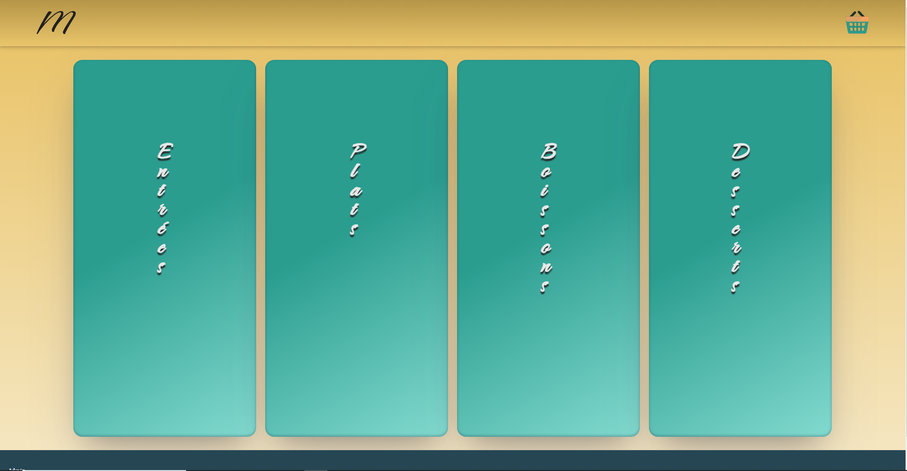

## Miam

## Fr

### Description

Site de commande pour restaurant.

### Détails

Voici un site de commande pour un restaurant, le client commande et paye sur son téléphone, ensuite la commande est envoyé au restaurateur, le restaurateur pourra visualiser toutes les commandes puis les valider une fois servie.

Les parties admins sont normalement réservé à un admin, cependant pour que tu puisses accéder à la totalité du site le mode administration est desactivé, l'administration sera bien évidement activé si le site est en ligne.

La base de données est [ici](https://github.com/SebLau02/miam-server) si tu veux y jeter un oeil.

Je te laisse le découvrir [ici](https://miam-olive.vercel.app/)

## En

Here's a website for ordering food from a restaurant. The customer can order and pay on their phone, and then the order is sent to the restaurant owner. The owner can view all orders and validate them once they've been served.

The admin parts are normally reserved for an admin, but in order for you to access the entire site, the admin mode is disabled. However, if it was online admin parts will be activated.

Database is [here](https://github.com/SebLau02/miam-server) if you want to see it.

To view the site, click [here](https://miam-olive.vercel.app/)

### Technologies: React.Js

### Images:

